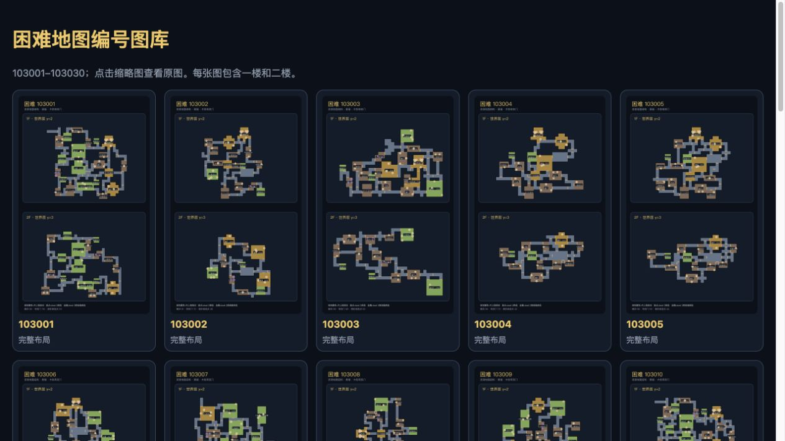
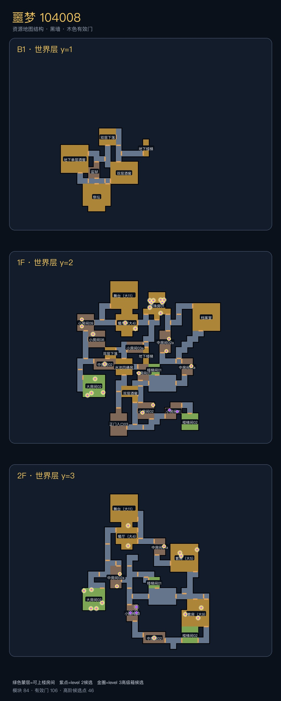
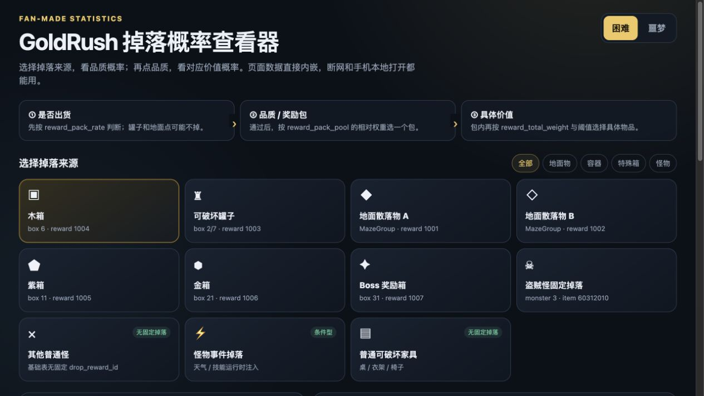
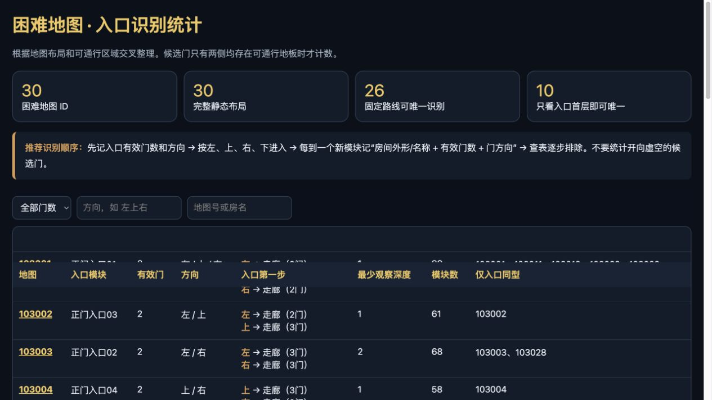

# 第五人格 · 加页手记｜困难模式与噩梦模式地图攻略

这是一个面向玩家的非官方、非商业静态攻略项目，提供第五人格加页手记困难模式与噩梦模式地图图片、入口辨认和掉落概率浏览功能。

关键词：第五人格、加页手记、困难模式、噩梦模式、地图攻略、宝箱概率、掉落概率、地图辨认。

## 在线页面

- [网站首页](https://lemou-memo.github.io/identityv-journal-guide/)
- [困难模式 · 30 张地图](https://lemou-memo.github.io/identityv-journal-guide/hard_maps/)：103001–103030，每张图片包含 1F / 2F，适合手机保存。
- [噩梦模式 · 13 张三层地图](https://lemou-memo.github.io/identityv-journal-guide/nightmare_maps/)：104001–104013，每张图片包含地下层（B1）、1F 和 2F，适合手机保存。
- [掉落概率查看器](https://lemou-memo.github.io/identityv-journal-guide/loot_explorer.html)：按掉落来源、品质和价值查看静态概率。
- [地图辨认工具](https://lemou-memo.github.io/identityv-journal-guide/map_identification.html)：按入口门数、方向及后续房间辨认地图编号。

## 功能预览

### 30 张困难地图

### 13 张噩梦三层地图

### 掉落概率查看器

### 地图辨认工具

## 项目边界

本仓库仅包含：

- 独立编写的 HTML、CSS 和 JavaScript；
- 独立绘制的示意地图 PNG；
- 公开页面的功能预览截图；
- 玩家攻略性质的统计和文字说明。

本仓库不包含：

- 游戏客户端、可执行文件或原始资源包；
- 游戏提取的图片、模型、音频、字体或其他素材；
- 反编译代码、解密密钥、解包器或规避技术措施的工具；
- 进程读取、封包分析、自动操作、修改客户端或实时定位功能。

请不要向仓库提交 `.wpk`、`.idx`、`.gim`、`.exe`、反编译文件或其他游戏原始资源。

## 数据说明

- 页面展示的是静态整理结果，不代表服务器当前配置。
- 特殊箱标记表示候选生成位置，不保证每局出现，也不保证具体品质。
- 掉落可能受到版本、服务器热更新、活动、难度和运行时条件影响。
- 房间名称中存在便于辨认的玩家称呼，不一定是官方名称。
- 如发现错误，建议通过 Issue 提供游戏版本、地图编号和截图，不要上传客户端资源。

## 本地运行

直接打开根目录的 `index.html` 即可。发布到 GitHub Pages 后，四个入口和图片链接也会按相同目录结构工作。

## GitHub Pages

将此目录作为仓库根目录上传，然后在仓库的 **Settings → Pages** 中选择从默认分支根目录部署。入口文件已经设置为 `index.html`。

## 许可和权利声明

`LICENSE` 仅适用于本项目贡献者独立编写的程序代码，不授予任何第三方游戏名称、商标、关卡设计、数据或其他内容的权利。地图示意图和整理数据仅作为非商业攻略资料提供；若你准备转载、商业使用或制作衍生产品，应自行确认并取得所需授权。

本项目与游戏开发商、发行商不存在隶属、授权或背书关系。详见 [NOTICE.md](NOTICE.md)。

## 免责声明

本项目按现状提供，不保证准确性、完整性或持续可用性。维护者会尊重权利人的合理请求；如需联系，请通过仓库 Issue 或维护者公开联系方式。
